# SocietyPro — System Architecture Analysis

> **Role**: Principal Software Architect  
> **Date**: September 17, 2026  
> **Stack**: MERN (MongoDB · Express · React · Node.js)

---

## 1. High-Level System Overview

### Tech Stack

| Layer | Technology | Version / Notes |
|---|---|---|
| **Frontend** | React 19 + Vite 8 | SPA, ES Modules |
| **Styling** | TailwindCSS v4 | Utility-first CSS |
| **Router (Client)** | React Router DOM v7 | Declarative routing |
| **HTTP Client** | Axios | With request interceptors |
| **State (Client)** | React Context API | `AuthContext` — token + user |
| **Backend** | Node.js + Express 5 | CommonJS modules |
| **Database** | MongoDB Atlas | Replica Set (3-shard cluster) |
| **ODM** | Mongoose 9 | Schema validation + ODM |
| **Auth** | JWT (jsonwebtoken) | 7-day expiry, Bearer token |
| **Password Hashing** | bcryptjs | Salt rounds: 10 |
| **Payment Gateway** | Razorpay SDK | Orders + HMAC verification |
| **Dev Server** | nodemon | Backend hot-reload |

### Core Architectural Pattern

**Layered Monolith (MVC-adjacent)** with a clear 4-layer separation:

```
Presentation  →  Routing  →  Controllers (Business Logic)  →  Data Access (Models)
```

The system also applies a **Multi-Tenant by Convention** pattern: every protected resource is scoped to `societyId` extracted from the JWT, preventing cross-society data leakage without a dedicated tenant registry table.

---

## 2. Architectural Flowchart

```mermaid
flowchart TD
    subgraph CLIENT["🖥️ Client Layer — React 19 + Vite SPA"]
        direction TB
        UI_AUTH["Login / Register Pages"]
        UI_DASH["Dashboard Page"]
        UI_SOC["SocietyManagement Page"]
        UI_COM["CommitteeManagement Page"]
        UI_RES["ResidentManagement Page"]
        UI_PAY["Payments Page"]

        AUTH_CTX["AuthContext\n(React Context)\ntoken, user, login(), logout()"]
        LOCAL_STORE["localStorage\n(token + user JSON)"]
        AXIOS["axiosInstance\n(Axios + Request Interceptor)\nAuto-attach Bearer token"]
        PROT_ROUTE["ProtectedRoute\nComponent\nRole guard + redirect"]

        AUTH_CTX <-->|"read/write on login/logout"| LOCAL_STORE
        PROT_ROUTE -->|"reads isAuthenticated, role"| AUTH_CTX
        UI_AUTH -->|"login() / on success"| AUTH_CTX
        UI_DASH & UI_SOC & UI_COM & UI_RES & UI_PAY -->|"all requests via"| AXIOS
        AXIOS -->|"reads token from"| LOCAL_STORE
    end

    subgraph ROUTER["🌐 Client Router — React Router DOM v7"]
        direction LR
        R_PUBLIC["/login · /register\nPublic Routes"]
        R_PRIVATE["/ · /societies · /committee\n/residents · /payments\nPrivate Routes (ProtectedRoute)"]
    end

    subgraph BACKEND["⚙️ Backend — Node.js + Express 5"]
        direction TB

        subgraph MW["🛡️ Middleware Layer"]
            direction LR
            CORS["cors()\nGlobal CORS"]
            JSON_PARSE["express.json()\nBody Parser"]
            TENANT_MW["tenantMiddleware\nJWT verify → req.user\n{id, role, societyId, permissions}"]
            ROLE_MW["requireRole(...roles)\nRole Allowlist Guard"]
            PERM_MW["requirePermission(perm)\nGranular Permission Guard\n(Owner bypasses, Committee checks array)"]
        end

        subgraph ROUTES["📡 Route Layer"]
            direction TB
            RT_AUTH["/api/auth\nauthRoutes\n(Public — no middleware)"]
            RT_SOC["/api/society\nsocietyRoutes\n(tenantMW + requireRole/requirePermission)"]
            RT_USR["/api/users\nuserRoutes\n(tenantMW + requirePermission)"]
            RT_PAY["/api/payments\npaymentRoutes\n(tenantMW + requireRole)"]
            RT_COM["/api/committee\ncommitteeRoutes\n(tenantMW + requireRole SocietyOwner)"]
        end

        subgraph CTRL["🧠 Controller Layer — Business Logic"]
            direction TB
            C_AUTH["authController\n• registerOwner\n• registerResident\n• loginUser"]
            C_SOC["societyController\n• getSocietyById · updateSociety · deleteSociety\n• getDefaultRates · updateDefaultRates\n• getLateFeeSettings · updateLateFeeSettings"]
            C_USR["userController\n• getSocietyUsers · getUserById\n• updateUser · deleteUser\n• getResidentRate · setResidentCustomRate"]
            C_PAY["paymentController\n• createOrder · verifyPayment\n• generateBill · getBills"]
            C_COM["committeeController\n• createCommittee · getCommitteeMembers\n• updateCommitteePermissions · deleteCommittee"]
        end

        subgraph UTILS["🔧 Utility Layer"]
            U_CODE["generateSocietyCode\nRandom ABC1234 code\n(collision-safe loop)"]
            U_FEE["calculateLateFee\n(amount, rate%, daysOverdue, gracePeriod)\n→ pro-rated daily fee"]
            CFG_RZP["config/razorpay.js\nRazorpay SDK Instance\n(key_id + key_secret)"]
        end

        subgraph MODELS["🗃️ Data Access Layer — Mongoose ODM"]
            M_USER["User Model\n• name, email, passwordHash\n• role: SocietyOwner | Committee | Resident\n• societyId (ref: Society)\n• permissions[ ]\n• unitNumber\n• customRateItems[ ]\n• usingCustomRate"]
            M_SOC["Society Model\n• name, address, city\n• societyCode (unique)\n• ownerId (ref: User)\n• defaultRateItems[ ]\n• lateFeeSettings\n  {ratePercentPerYear, gracePeriodDays, dueDateDay}"]
            M_PAY["Payment Model\n• societyId, residentId\n• amount (paise), currency\n• razorpayOrderId, razorpayPaymentId\n• status: created|authorized|captured|failed\n• unitNumber, month, dueDate"]
        end
    end

    subgraph DB["🍃 MongoDB Atlas — Replica Set (3 Shards)"]
        COL_USER[("users collection")]
        COL_SOC[("societies collection")]
        COL_PAY[("payments collection")]
    end

    subgraph EXT["🌍 External Services"]
        RZP_API["Razorpay API\norders.create()\nHMAC-SHA256 signature verify"]
        JWT_LIB["jsonwebtoken\n(sign / verify)"]
        BCRYPT["bcryptjs\n(genSalt / hash / compare)"]
    end

    %% Client → Router
    CLIENT -->|"React Router navigation"| ROUTER

    %% Client → Backend (HTTPS REST)
    AXIOS -->|"HTTPS / REST — JSON"| BACKEND

    %% Global middleware fires first
    CORS --> JSON_PARSE --> ROUTES

    %% Routes → Middleware chains
    RT_AUTH --> C_AUTH
    RT_SOC -->|"tenantMW → requireRole/requirePermission"| TENANT_MW --> ROLE_MW & PERM_MW --> C_SOC
    RT_USR -->|"tenantMW → requirePermission"| TENANT_MW --> PERM_MW --> C_USR
    RT_PAY -->|"tenantMW → requireRole"| TENANT_MW --> ROLE_MW --> C_PAY
    RT_COM -->|"tenantMW → requireRole(SocietyOwner)"| TENANT_MW --> ROLE_MW --> C_COM

    %% Controllers → Models
    C_AUTH -->|"Mongoose ODM"| M_USER & M_SOC
    C_SOC -->|"Mongoose ODM"| M_SOC
    C_USR -->|"Mongoose ODM"| M_USER & M_SOC
    C_PAY -->|"Mongoose ODM"| M_PAY & M_USER
    C_COM -->|"Mongoose ODM"| M_USER

    %% Controllers → Utils
    C_AUTH --> U_CODE
    C_PAY --> CFG_RZP

    %% Models → DB
    M_USER -->|"Mongoose ODM"| COL_USER
    M_SOC -->|"Mongoose ODM"| COL_SOC
    M_PAY -->|"Mongoose ODM"| COL_PAY

    %% Controllers → External
    C_AUTH --> BCRYPT & JWT_LIB
    C_PAY --> RZP_API
    TENANT_MW --> JWT_LIB

    %% Styling
    classDef clientNode fill:#1e3a5f,stroke:#3b82f6,color:#e2e8f0
    classDef backendNode fill:#1a3326,stroke:#10b981,color:#e2e8f0
    classDef dbNode fill:#3b1f1f,stroke:#ef4444,color:#e2e8f0
    classDef extNode fill:#2d1f3b,stroke:#a855f7,color:#e2e8f0
    classDef mwNode fill:#1f2d3b,stroke:#f59e0b,color:#e2e8f0

    class UI_AUTH,UI_DASH,UI_SOC,UI_COM,UI_RES,UI_PAY,AUTH_CTX,LOCAL_STORE,AXIOS,PROT_ROUTE,R_PUBLIC,R_PRIVATE clientNode
    class C_AUTH,C_SOC,C_USR,C_PAY,C_COM,M_USER,M_SOC,M_PAY,U_CODE,U_FEE,CFG_RZP backendNode
    class COL_USER,COL_SOC,COL_PAY dbNode
    class RZP_API,JWT_LIB,BCRYPT extNode
    class CORS,JSON_PARSE,TENANT_MW,ROLE_MW,PERM_MW mwNode
```



---

## 3. End-to-End Request Lifecycle

### Traced Flow: Resident Initiates a Maintenance Payment

```
Step  Component                 Action
────  ─────────────────────────────────────────────────────────────────────────────
 1    Browser (Payments.jsx)    User clicks "Pay Now". React reads effective rate
                                 from AuthContext (societyId, usingCustomRate flag).

 2    axiosInstance             POST /api/payments/create-order
                                 Request interceptor reads token from localStorage,
                                 adds "Authorization: Bearer <JWT>" header.

 3    Express CORS + JSON MW    cors() validates Origin; express.json() parses body.

 4    paymentRoutes             Matches POST /create-order route.
                                 Applies: tenantMiddleware → requireRole('Resident')

 5    tenantMiddleware          jwt.verify(token, JWT_SECRET)
                                 Populates req.user = { id, role, societyId, permissions }
                                 ❌ Invalid/expired → 401 Unauthorized

 6    requireRole('Resident')   Checks req.user.role === 'Resident'
                                 ❌ Wrong role → 403 Forbidden

 7    paymentController         createOrder() executes:
      .createOrder()             a. User.findById(req.user.id)           → fetch resident
                                 b. razorpayInstance.orders.create({     → Razorpay API call
                                      amount, currency, receipt })
                                 c. Payment.create({ ...razorpayOrderId,
                                      societyId, residentId, status:'created' })
                                                                         → MongoDB write

 8    Razorpay API              Returns { id: "order_xxx", amount, currency }

 9    paymentController         Returns 201 JSON: { orderId, amount, key, paymentRecordId }

10    Frontend (Payments.jsx)   Opens Razorpay Checkout modal with orderId + key.
                                 User completes UPI/Card payment.

11    Razorpay Callback         Razorpay redirects with:
                                 { razorpay_order_id, razorpay_payment_id,
                                   razorpay_signature }

12    axiosInstance             POST /api/payments/verify  (same JWT header)

13    tenantMiddleware +        JWT verify → requireRole('Resident') — same as steps 4-6
      requireRole

14    paymentController         verifyPayment() executes:
      .verifyPayment()           a. crypto.createHmac('sha256', RAZORPAY_KEY_SECRET)
                                      .update(`${order_id}|${payment_id}`)
                                      .digest('hex')
                                 b. Compare generated vs received signature
                                    ❌ Mismatch → Payment.update(status:'failed') → 400
                                    ✅ Match    → Payment.update(status:'captured')

15    MongoDB Atlas              Payment document updated: status = 'captured',
                                 razorpayPaymentId stored.

16    Express → Frontend        200 JSON: { payment: { ...captured record } }

17    Payments.jsx              Updates UI state; payment marked as successful.
```

---

## 4. Key Architectural Observations

### ✅ Strengths

| Observation | Detail |
|---|---|
| **Clean Layered Separation** | Routes → Middleware → Controllers → Models is consistently upheld. Controllers never import route files; models have no business logic. |
| **Multi-Tenant Isolation via JWT** | `societyId` is encoded in the JWT and validated in every protected controller. Cross-society access is impossible without a valid matching token. |
| **3-Tier Permission System** | `tenantMiddleware` (authentication) → `requireRole` (coarse role check) → `requirePermission` (fine-grained capability check). SocietyOwner is always a super-set, Committee has an explicit `permissions[]` array, Residents have no elevated access. |
| **Payment Signature Verification** | Razorpay HMAC-SHA256 signature verified server-side before any DB `captured` status write — prevents replay/spoofed payment attacks. |
| **Custom Rate Override Pattern** | Resident-level `customRateItems` + `usingCustomRate` flag provides clean override semantics on top of `Society.defaultRateItems`. Fallback to default is explicit and readable. |
| **Idempotent Society Code Generation** | Collision-safe `while(!isUnique)` loop for societyCode. Safe for low-volume use. |

### ⚠️ Potential Bottlenecks & Issues

| Issue | Severity | Notes |
|---|---|---|
| **No refresh token / token rotation** | Medium | JWT has a 7-day hard expiry with no revocation mechanism. A stolen token is valid for up to 7 days. |
| **JWT_SECRET in .env committed to repo risk** | High | The `.gitignore` does not include `.env` for the backend — verify secrets are not pushed. |
| **No database indexes defined in schema** | Medium | `User.email` has `unique: true` (auto-index), but `societyId` lookups across `Payment` and `User` collections have no declared compound indexes, which will degrade under load. |
| **Tightly coupled CORS — `cors()` with no origin whitelist** | Medium | `app.use(cors())` with no config accepts requests from any origin. Should whitelist the Vite dev server and production domain. |
| **`generateUniqueSocietyCode` retry loop** | Low | As society count grows, the collision probability increases. A UUID or snowflake ID would be safer at scale. |
| **Payment amount unit inconsistency** | Low | `generateBill` receives amount in rupees, converts to paise. `createOrder` also converts. But `Payment.amount` stores paise — UI must always divide by 100, which is implicit and error-prone. |
| **`/residents` route guarded by `'SocietyAdmin'` role** | Bug | In [App.jsx](file:///c:/Users/priya/Desktop/SocietyPro_MERN/frontend/src/App.jsx#L63), `allowedRoles={['SocietyAdmin']}` — but the role enum in [User.js](file:///c:/Users/priya/Desktop/SocietyPro_MERN/backend/models/User.js#L20) has no `'SocietyAdmin'` value. The actual role is `'SocietyOwner'`. This means the Resident Management page is effectively **inaccessible to any user**. |
| **No global Express error-handling middleware** | Low | Each controller has its own `catch` block returning 500. A centralized error handler would standardize error responses and allow easier logging/monitoring integration. |

---

## 5. API Surface Summary

| Method | Endpoint | Auth | Roles Allowed | Description |
|---|---|---|---|---|
| POST | `/api/auth/register-owner` | None | Public | Register SocietyOwner + create Society |
| POST | `/api/auth/register-resident` | None | Public | Register Resident with societyCode |
| POST | `/api/auth/login` | None | Public | Login → JWT |
| GET | `/api/society/rates/default` | JWT | All | Fetch society default rate items |
| PATCH | `/api/society/rates/default` | JWT | SocietyOwner | Update default rate items |
| GET | `/api/society/late-fee-settings` | JWT | All | Fetch late fee settings |
| PATCH | `/api/society/late-fee-settings` | JWT | SocietyOwner | Update late fee settings |
| GET | `/api/society/:id` | JWT | Owner+perm | Get society by ID |
| PATCH | `/api/society/:id` | JWT | Owner+perm | Update society |
| DELETE | `/api/society/:id` | JWT | Owner+perm | Delete society |
| GET | `/api/users/` | JWT | manageResidents | List all society users |
| GET | `/api/users/:id` | JWT | manageResidents | Get user by ID |
| PATCH | `/api/users/:id` | JWT | manageResidents | Update user |
| DELETE | `/api/users/:id` | JWT | manageResidents | Remove user |
| GET | `/api/users/:id/rate` | JWT | Owner/Committee/Self | Get effective rate for resident |
| PATCH | `/api/users/:id/rate` | JWT | manageResidents | Set custom rate for resident |
| POST | `/api/payments/create-order` | JWT | Resident | Create Razorpay order |
| POST | `/api/payments/verify` | JWT | Resident | Verify payment + update DB |
| POST | `/api/payments/generate-bill` | JWT | Owner / manageBills | Generate a bill for resident |
| GET | `/api/payments/` | JWT | All (filtered) | Get bills (role-scoped) |
| POST | `/api/committee/` | JWT | SocietyOwner | Create committee member |
| GET | `/api/committee/` | JWT | SocietyOwner | List committee members |
| PATCH | `/api/committee/:id` | JWT | SocietyOwner | Update permissions/label |
| DELETE | `/api/committee/:id` | JWT | SocietyOwner | Remove committee member |
